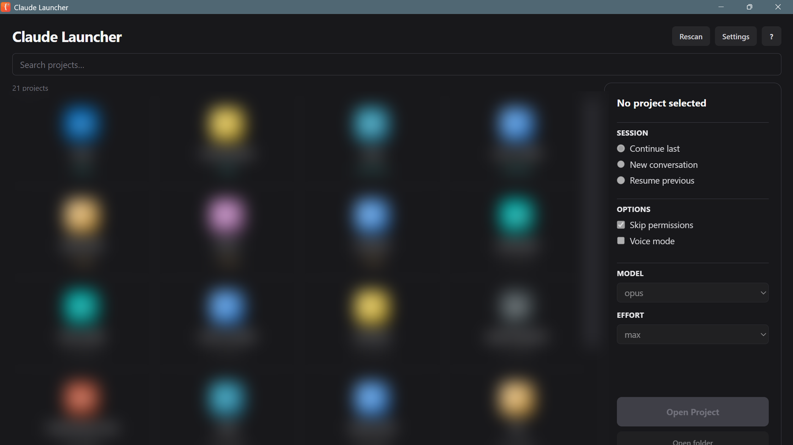

<div align="center">

# Claude Launcher

**A no-nonsense GUI to launch [Claude Code](https://claude.com/claude-code) sessions across all your projects, sorted by last activity.**

[](LICENSE)
[](https://github.com/sponsors/carlosvales)
[](https://tauri.app)
[](https://rust-lang.org)
[](https://github.com/carlosvales/claude-launcher/stargazers)

> Stop typing `cd path/to/project && claude --continue --model opus` ten times a day. Click a card. Done.



</div>

---

## Why

If you work on more than 2-3 projects with Claude Code, you've been here:

- Forgetting which model you used last on each project
- Re-typing the same `--continue --dangerously-skip-permissions --model opus --effort max` flags
- Losing track of which project had a session active 3 days ago

Claude Launcher reads your `~/.claude/projects/` directory, sorts your projects by last session time, and remembers per-project preferences (model, effort, session mode, voice, skip permissions). One double-click → your terminal opens at the project root with `claude` running with your saved options.

## Features

- **Project grid** sorted by last Claude Code session, with a relative time badge per card (`today`, `2d ago`, `3w ago`)
- **Per-project preferences** — model, effort, session mode, skip-permissions, voice — auto-restored on next click
- **Live search** — filter the grid as you type
- **Settings dialog** — native folder picker for `projects_dir`, defaults
- **Help / how-it-works dialog** — built-in explanation of every option, no need to dig through docs
- **First-run onboarding** — opens Settings automatically when no projects are found
- **Single config file** — no database, no telemetry, ~9 MB installed
- **Cross-platform terminal launch** — Windows Terminal / PowerShell / cmd.exe on Windows, Terminal.app on macOS, gnome-terminal / konsole / xterm on Linux

## Install

### Windows (recommended)

Download the latest installer from [Releases](https://github.com/carlosvales/claude-launcher/releases) and run it. Two formats are published:

- `Claude.Launcher_<version>_x64-setup.exe` — NSIS installer, ~2 MB, recommended
- `Claude.Launcher_<version>_x64_en-US.msi` — for silent / enterprise install

Windows SmartScreen will warn on first run because the installer is unsigned. Click **More info → Run anyway**.

### Build from source

Requires Rust 1.95+, Node 20.19+ (or 22+), and platform build tools (MSVC on Windows, Xcode CLT on macOS, `webkit2gtk` on Linux).

```bash
git clone https://github.com/carlosvales/claude-launcher
cd claude-launcher
npm install
npm run tauri build
```

The binary lands in `src-tauri/target/release/bundle/`.

For development with hot reload:

```bash
npm run tauri dev
```

## Configuration

Config lives in `%APPDATA%/claudelauncher/config.json` (Windows) or `~/.config/claudelauncher/config.json` (Linux/Mac). Click **Settings** in the app to edit through the UI, or edit by hand:

```json
{
  "projectsDir": "~/Documents/Code",
  "defaultOptions": {
    "session": "continue",
    "skipPerms": true,
    "voice": false,
    "model": "opus",
    "effort": "max"
  }
}
```

| Key | Description | Default |
|---|---|---|
| `projectsDir` | Folder scanned for project subfolders | `~/Documents/Code` |
| `defaultOptions.session` | `continue`, `new`, or `resume` | `continue` |
| `defaultOptions.skipPerms` | Pass `--dangerously-skip-permissions` | `true` |
| `defaultOptions.voice` | Voice mode flag (reserved) | `false` |
| `defaultOptions.model` | `opus`, `sonnet`, or `haiku` | `opus` |
| `defaultOptions.effort` | `low`, `medium`, `high`, or `max` | `max` |

Per-project overrides are saved automatically under the `projects` key when you launch a project.

## Keyboard shortcuts

| Key | Action |
|---|---|
| `Enter` | Launch selected project |
| `Esc` | Deselect / close modal |
| Double-click on card | Launch immediately |

## Tech

- **Tauri 2** + **Rust 1.95** — desktop runtime, ~9 MB bundle
- **React 19** + **TypeScript** + **Tailwind CSS v4** — UI

## Roadmap

- [x] Tauri 2 + React UI
- [x] Settings + Help dialogs
- [x] Onboarding flow
- [x] Windows release pipeline (GitHub Actions)
- [x] Cross-platform terminal fallback chain (wt → PowerShell → cmd.exe; gnome-terminal → konsole → xterm)
- [ ] macOS support (Tauri code is ready, needs `Terminal.app` validation + `.dmg` packaging)
- [ ] Linux support (Tauri code is ready, needs terminal validation + `.deb` / `.AppImage` packaging)
- [ ] Pinned projects
- [ ] Per-project environment variables
- [ ] Recent commands history per project

## Contributing

PRs welcome. See [CONTRIBUTING.md](CONTRIBUTING.md) for the workflow.

Especially helpful right now:

- **macOS port** — validate `osascript` launch logic, package `.dmg`
- **Linux port** — validate terminal fallbacks, package `.deb` and `.AppImage`

## Support development

Claude Launcher is free and open source. If it saves you time and you want to support continued development:

- [Sponsor on GitHub](https://github.com/sponsors/carlosvales) — recurring or one-time, 0% fees
- Star the repo and share it — costs nothing, helps a lot

Sponsorships go directly into bug fixes, cross-platform support, and new features.

## Disclaimer

This is an unofficial third-party tool. Not affiliated with, endorsed by, or sponsored by Anthropic. "Claude" is a trademark of Anthropic, PBC.

## License

[MIT](LICENSE) © 2026 Carlos Valés
